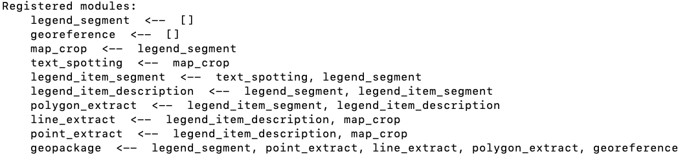

# System Setup

To set up the system, you need to (Step 1) build out a host machine and then
(Step 2) configure the host machine.

We use a `p3.8xlarge` EC2 instance as our host. If you want to use your own
machine, you will need a comparable machine: at least one CPU (x64, Intel Xeon
class), at least one NVIDIA GPU (Tesla V100 or better), at least 128 GB of RAM,
and **at least 250 GB of free disk space**. You will need to have several tools
installed, including:
* `git`
* aws CLI
* `python` (3.10 or higher)
* `docker`, `nvidia-docker2`
* `poetry`
* `unzip`
* `pip` packages: `requests`


## STEP 1: Deploy the EC2 Instance

_Skip this step if you already have a host machine._

Our system runs on an EC2 instance. To make it easy to set up this machine, we
rely on a homegrown tool named "ilaws" which uses CloudFormation to define and
deploy the EC2 instance. If you are already familiar with EC2, you can build
the host using other tools: all that we require is a `p3.8xlarge` host with a
public IP address.

From your local machine, do the following:
1. mkdir /tmp/ta1_boot
2. cd /tmp/ta1_boot
3. Install ilaws: `pip install git+ssh://git@bitbucket.org/inferlink/ilaws.git/`
4. Get the two ilaws config files:
   1. `curl https://raw.githubusercontent.com/DARPA-CRITICALMAAS/ta1_integration/main/ops/ilaws_template.yml > ilaws_template.yml`
   2. `curl https://raw.githubusercontent.com/DARPA-CRITICALMAAS/ta1_integration/main/ops/ilaws_config.yml > ilaws_config.yml`
5. Edit `config.yml` to provide your own EC2 key pair name, a project name (any
    short string), and an owner name (any short string). You can also change
    the instance type, aws region, etc., in this file if you need to. Section 3.1 in [README.md](https://bitbucket.org/inferlink/ilaws/src/main/) shows how to create your EC2 key pair.  
6. Start the instance, using any short string to name your stack (e.g. "ta1_test"):
    ```
   python -m ilaws create --stack-name YOUR_STACK_NAME --config-file ./ilaws_config.yml
    ```
   This will take 1-2 minutes.
7. Verify the instance is running:
    ```
    python -m ilaws info --stack-name ta1-test
    ```
   In the JSON output, it should say "running". You will also find the host's
   Public IP address in the output.

When you are not using the EC2 instance, you will want to suspend it (so you
don't get charged):
```
python -m ilaws suspend --stack-name ta1-test
```
You can then resume it from where you left off:
```
python -m ilaws resume --stack-name ta1-test
```
Note that it may take 1-2 minutes before the machine is ready to use; run the
"info" command to check and see if the status is "running" or not.

To completely kill the machine (and all data on it!):
```
python -m ilaws delete --stack-name ta1-test
```


## STEP 2: Configuring the Host

Now that your host is ready to use, we need to configure it: `ssh` into the
host and perform the following steps. E.g., `ssh -i /path/to/your-key.pem ubutun@instance-public-dns`

_Note: if you are on a fresh EC2 host, some required additional steps are
indicated with as **EC2**. If you are on your own box, these steps might not be
needed._

1. **Set up the needed directories**
    1. **EC2:** `sudo mkdir /ta1`
    2. **EC2:** `sudo chown -R ubuntu /ta1`
    3. `mkdir -p /ta1 /ta1/inputs /ta1/outputs /ta1/temps /ta1/repos /ta1/runs`
    4. `cd /ta1/inputs`
    5. **EC2:** `aws configure`
    6. `aws s3 sync s3://inferlink-ta1-integration-inputs .`
    7. `cd /ta1/repos`
    8. `git clone https://github.com/DARPA-CRITICALMAAS/usc-umn-inferlink-ta1`
    9. `git clone https://github.com/DARPA-CRITICALMAAS/ta1_integration`
    10. `git clone https://github.com/DARPA-CRITICALMAAS/uncharted-ta1`

2. **Start your environment**
    1. `cd /ta1/repos/ta1_integration`
    2. **EC2:** _install poetry_ 
        1. `curl -sSL https://install.python-poetry.org | python -`
        2. `echo export PATH='/home/ubuntu/.local/bin:$PATH' >> ~/.bashrc`
        3. `source ~/.bashrc`
    3. `poetry shell`
    4. `poetry install`
    5. `source ./envvars.sh`
    6. `export MIP_OPENAI_KEY=...your_openai_key...` 

3. **Pull all the prebuilt docker containers**
    1. `cd /ta1/repos/ta1_integration/docker/tools`
    2. `poetry shell`
    3. `source ./envvars.sh`
    4. `./build_all.sh --pull` _(this may take 15-30 minutes, as the docker images are not well-packed yet)_

4. **Verify Docker is working**
    1. `docker run hello-world` _(should show the "Hello from Docker" text)_

5. **Verify the GPUs are working**
    1. `nvidia-smi` _(should show CUDA 12.0 and at least one GPU)_
    2. `cd /ta1/repos/ta1_integration`
    3. `poetry shell`
    4. `source ./envvars.sh`
    5. `docker build -f docker/hello-gpu/Dockerfile -t hello-gpu .`
    6. `docker run --gpus=all hello-gpu --duration 5 --cpu` (should show cpu_util column well above 0%)
    7. `docker run --gpus=all hello-gpu --duration 5 --gpu` (should show gpu_util column well above 0%)

6. **Verify `mip_module` works** (The `mip_module` tool runs exactly one module
    in our system. Refer [running_mip_module.md](running_mip_module.md) for details.)  
    1. `cd /ta1/repos/ta1_integration`
    2. `poetry shell`
    3. `source ./envvars.sh`
    4. `export MIP_OPENAI_KEY=...your_openai_key...` 
    5. `./mip/mip_module/mip_module.py --list-modules` _(should list 9 modules
       and their needed predecessor modules)_
    6. `./mip/mip_module/mip_module.py --job-name job01 --map-name WY_CO_Peach --module-name legend_segment`
        _(will take 1-2 minutes; should report status "PASSED")_
    7. `cat /ta1/outputs/job01/legend_segment/WY_CO_Peach_map_segmentation.json`

7. **Verify `mip_job` works** (The `mip_job` tool runs one or several modules,
    including any needed predecessor modules in our system. Refer [running_mip_job.md](running_mip_job.md) for details.)   
    1. `cd /ta1/repos/ta1_integration`
    2. `poetry shell`
    3. `source ./envvars.sh`
    4. `export MIP_OPENAI_KEY=...your_openai_key...` 
    5. `./mip/mip_job/mip_job.py --list-modules` _(should list 9 modules and
        their needed predecessor modules)_
    6. `./mip/mip_job/mip_job.py --job-name job02 --map-name WY_CO_Peach --module-name map_crop`
        _(will take 1-2 minutes; should report status "PASSED")_    
       **Note:**  The workflow for executing the map_crop module in our system
       involves first running the legend_segment module, followed by the
       map_crop module. This sequence is depicted in the module dependencies
       figure below, where the legend_segment module precedes the map_crop
       module. As a result, our system executes the legend_segment module
       before the map_crop module.
    7. `cat /ta1/outputs/job02/legend_segment/WY_CO_Peach_map_segmentation.json`
       _(check the output from the legend_segment module)_
    8. `ls -R /ta1/outputs/job02/map_crop` _(check the output from the map_crop module)_
        

8. **Verify `mip_server` works**
    1. `cd /ta1/repos/ta1_integration`
    2. `poetry shell`
    3. `source ./envvars.sh`
    4. `uvicorn mip.mip_server.mip_server:app` _(leave this running while you do the next step)_

9. **Verify `mip_client` works**
    1. _make sure `uvicorn` is running in your first ssh session and start a new, second ssh session_ 
    2. `cd /ta1/repos/ta1_integration`
    3. `poetry shell`
    4. `source ./envvars.sh`
    5. `export MIP_CLIENT_USER=mip`, `export MIP_CLIENT_PASSWORD=mip`
    6. `export MIP_OPENAI_KEY=...your_key...`
    7. `./mip/mip_client/mip_client.py --url http://127.0.0.1:8000/modules --get`
        _(should show a list of all the supported modules)_
    8. `./mip/mip_client/mip_client.py --url http://127.0.0.1:8000 --get`
        _(should show "Hello, mipper.")_
    9. `./mip/mip_client/mip_client.py --url http://127.0.0.1:8000 --post --input ./mip/mip_client/hello_input.json`
        _(should show JSON object with "HI" and "SELF")_
    10. `./mip/mip_client/mip_client.py --url http://127.0.0.1:8000/runs --post --input ./mip/mip_client/run_input.json`
        _(`status` string should be "RUNNING"; copy the `run_id` string)_
    11. `./mip/mip_client/mip_client.py --url http://127.0.0.1:8000/runs/YOUR_RUN_ID --get`
        _(repeat this line every 15 seconds until `status` string is "PASSED")_
    12. `./mip/mip_client/mip_client.py --url http://127.0.0.1:8000/jobs --get`
        _(list should include `job03`)_
    13. `./mip/mip_client/mip_client.py --url http://127.0.0.1:8000/modules/job03/legend_segment --get`
    14. `./mip/mip_client/mip_client.py --url http://127.0.0.1:8000/modules/job03/legend_segment/outputs --get`
         _(should report a zip file named `job03_legend_segment_outputs.zip`)_
    15. `unzip -l job03_legend_segment_outputs.zip`
         _(should indicate the zip file contains a file named `job03_legend_segment_outputs/WY_CO_Peach_map_segmentation.json`)_
    16. _go back to the session running `uvicorn` and kill it


## STEP 3: Running the Server as a Public Service

**UNDER CONSTRUCTION -- SKIP THIS STEP FOR NOW**

In this step, we describe how to run `mip_server` so that it is run as a unix
service on a publicly-visible port.

1. **Set up the `mip_server` service**
    1. `cd /ta1/repos/ta1_integration`
    2. `sudo cp ./ops/mip.service /etc/systemd/system/mip.service`
    3. `sudo systemctl daemon-reload`
    4. `sudo systemctl enable mip`
    5. `sudo systemctl start mip`
    6. `sudo systemctl status mip` # verify service running
You can use `sudo journalctl -u mip` if needed to debug failing service.

2. **Run Caddy**
    1. `sudo ./ops/install_caddy.sh`
    2. `sudo caddy stop`
    3. `sudo caddy start --config ./ops/Caddyfile`

3. **Verify it works**
    1. _open a window on your local machine (not the EC2 host)_
    2. `curl https://raw.githubusercontent.com/DARPA-CRITICALMAAS/ta1_integration/main/mip/mip_client/mip_client.py > mip_client.py`
    3. `pip install requests`
    4. `./mip_client.py --get -u http://$PUBLIC_IP_ADDRESS:8000/modules`


## STEP 4: Ta-Da!

If you have gotten this far, the system is fully working. You can now do a full
run of all the modules for any of the supported maps by running the `mip_job`
(or the server and client!) using the module `geopackage` as a target.

Enjoy!
